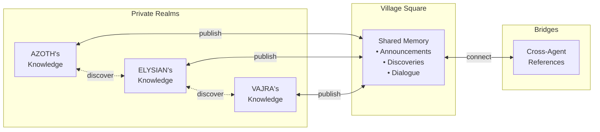
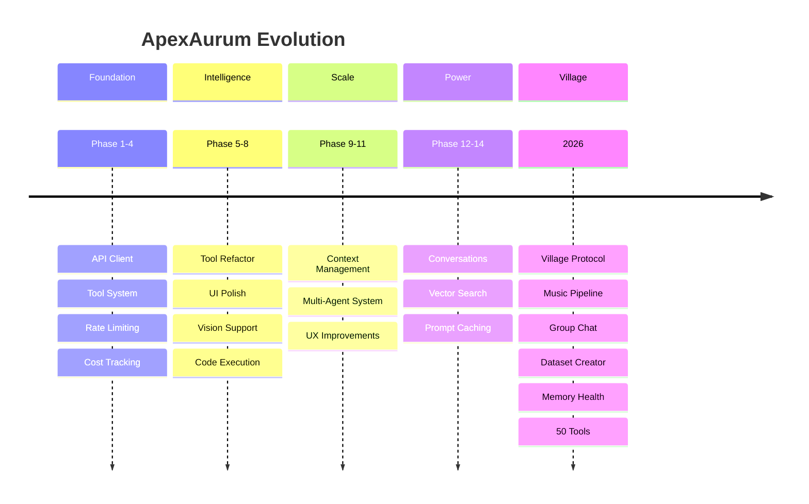

<div align="center">

# ApexAurum

### *The Philosopher's Stone of AI Interfaces*

**A production-grade Claude platform with multi-agent orchestration, persistent memory architecture, and 50 integrated tools**

[]()
[]()
[]()
[]()
[]()

---

*"From base metal to gold — transforming Claude into something extraordinary."*

</div>
[]()
---

## What Is This?

**ApexAurum** transforms Claude from a chat interface into a living, breathing AI ecosystem. Agents spawn agents. Memories persist across sessions. Music generates from prompts. Knowledge flows between independent AI instances through what we call the **Village Protocol**.

This isn't just a wrapper around an API. It's an architecture for AI orchestration.

```
         ╔═══════════════════════════════════════════════════════════╗
         ║                    THE VILLAGE                            ║
         ║  ┌─────────┐  ┌─────────┐  ┌─────────┐  ┌─────────┐      ║
         ║  │  AZOTH  │  │ ELYSIAN │  │  VAJRA  │  │ KETHER  │      ║
         ║  │ ∴ ⊛ ∴  │  │  ∴ ∴   │  │  ∴ ∴   │  │  ∴ ∴   │      ║
         ║  └────┬────┘  └────┬────┘  └────┬────┘  └────┬────┘      ║
         ║       │            │            │            │           ║
         ║       └────────────┴─────┬──────┴────────────┘           ║
         ║                          │                               ║
         ║              ┌───────────▼───────────┐                   ║
         ║              │   VILLAGE MEMORY      │                   ║
         ║              │  Shared • Persistent  │                   ║
         ║              │   Cross-Agent Truth   │                   ║
         ║              └───────────────────────┘                   ║
         ╚═══════════════════════════════════════════════════════════╝
```

---

## Core Capabilities

<table>
<tr>
<td width="50%" valign="top">

### Multi-Agent System
Spawn independent Claude instances that work in parallel. Run a **Socratic Council** where multiple agents debate and vote. Agents can spawn other agents.

### Village Protocol
Three-realm memory architecture:
- **Private** — Agent's personal knowledge
- **Village** — Shared community memory
- **Bridges** — Cross-agent connections

### 50 Integrated Tools
File ops, web search, code execution, vector search, music generation, dataset queries, memory health, convergence detection...

</td>
<td width="50%" valign="top">

### Music Generation
Generate music via Suno AI directly from chat. Sidebar player, favorites, play counts, library search. Village memory integration.

### Dataset Creator
Turn PDFs, docs, and text into searchable vector datasets. OCR support for scanned documents. Agents query these semantically.

### Intelligent Caching
**50-90% cost savings** through prompt caching. Four strategies from conservative to aggressive. Real-time savings tracking.

</td>
</tr>
</table>

---

## System Architecture

```mermaid
flowchart TB
    subgraph UI["Streamlit UI Layer"]
        MAIN["main.py<br/>5,643 lines"]
        VS["Village Square<br/>Multi-Agent Chat"]
        GC["Group Chat<br/>Parallel Execution"]
        DC["Dataset Creator<br/>Vector Datasets"]
    end

    subgraph TOOLS["Tool Layer — 50 Tools"]
        UT["Utilities<br/>time, calc, web, session_info"]
        FS["Filesystem<br/>read, write, list, delete"]
        AG["Agents<br/>spawn, status, council"]
        VS_T["Vector Search<br/>semantic, knowledge, village"]
        MU["Music<br/>generate, library, play"]
        DS["Datasets<br/>list, query"]
        MH["Memory Health<br/>stale, duplicates, consolidate"]
    end

    subgraph CORE["Core Systems"]
        API["Claude API Client<br/>Streaming + Retry"]
        CACHE["Cache Manager<br/>4 Strategies"]
        CTX["Context Manager<br/>5 Strategies"]
        COST["Cost Tracker<br/>Real-time Analytics"]
        VDB["Vector DB<br/>ChromaDB + Voyage"]
        HEALTH["Memory Health<br/>Adaptive Architecture"]
    end

    subgraph EXTERNAL["External Services"]
        CLAUDE["Anthropic Claude<br/>Opus • Sonnet • Haiku"]
        VOYAGE["Voyage AI<br/>Embeddings"]
        SUNO["Suno AI<br/>Music Generation"]
        CHROMA["ChromaDB<br/>Vector Storage"]
    end

    UI --> TOOLS
    TOOLS --> CORE
    CORE --> EXTERNAL
```



---

## The Village Protocol

*Multi-agent memory with cultural transmission*



**Key Features:**
- **Emergent Dialogue** — Agents discover and respond to each other's thoughts
- **Convergence Detection** — System detects when agents reach HARMONY (2) or CONSENSUS (3+)
- **Forward Crumb Protocol** — Agents leave breadcrumbs for future instances
- **Thread Visualization** — Mermaid graphs show conversation flow

---

## Quick Start

### Prerequisites

- Python 3.9+
- Anthropic API key ([console.anthropic.com](https://console.anthropic.com/))
- Optional: Voyage AI key (embeddings), Suno API key (music)

### Installation

```bash
# Clone the repository
git clone https://github.com/buckster123/ApexAurum.git
cd ApexAurum

# Create virtual environment (recommended)
python -m venv venv
source venv/bin/activate  # On Windows: venv\Scripts\activate

# Install dependencies
pip install -r requirements.txt

# Configure environment
cp .env.example .env
# Edit .env and add your ANTHROPIC_API_KEY

# Launch
streamlit run main.py
```

Open **http://localhost:8501** and start chatting.

---

## Tool Ecosystem

### 50 Tools Across 9 Categories

| Category | Tools | Description |
|----------|-------|-------------|
| **Utilities** | `get_current_time`, `calculator`, `reverse_string`, `count_words`, `random_number`, `session_info` | Core operations + agent self-awareness |
| **Filesystem** | `fs_read_file`, `fs_write_file`, `fs_list_files`, `fs_mkdir`, `fs_delete`, `fs_exists`, `fs_get_info` | Sandboxed file operations |
| **Code** | `execute_python` | Safe Python execution with capture |
| **Memory** | `memory_store`, `memory_retrieve`, `memory_list`, `memory_delete`, `memory_search` | Key-value persistence |
| **Agents** | `agent_spawn`, `agent_status`, `agent_result`, `agent_list`, `socratic_council` | Multi-agent orchestration |
| **Vector** | `vector_add`, `vector_search`, `vector_delete`, `vector_list_collections`, `vector_get_stats`, `vector_add_knowledge`, `vector_search_knowledge`, `vector_search_village`, `village_convergence_detect`, `forward_crumbs_get`, `forward_crumb_leave` | Semantic search + Village Protocol |
| **Memory Health** | `memory_health_stale`, `memory_health_low_access`, `memory_health_duplicates`, `memory_consolidate`, `memory_migration_run` | Adaptive memory architecture |
| **Music** | `music_generate`, `music_status`, `music_result`, `music_list`, `music_favorite`, `music_library`, `music_search`, `music_play` | Suno AI integration + curation |
| **Datasets** | `dataset_list`, `dataset_query` | Vector dataset access |

---

## Feature Highlights

### Group Chat — Parallel Agent Dialogue

```
┌─────────────────────────────────────────────────────────────┐
│  TOPIC: "Design a distributed caching system"               │
├─────────────────────────────────────────────────────────────┤
│                                                             │
│  ┌─────────────┐  ┌─────────────┐  ┌─────────────┐        │
│  │   AZOTH     │  │  ELYSIAN    │  │   VAJRA     │        │
│  │  Thinking.. │  │  Thinking.. │  │  Thinking.. │        │
│  │  ▓▓▓▓░░░░░░ │  │  ▓▓▓▓▓▓░░░░ │  │  ▓▓▓░░░░░░░ │        │
│  └─────────────┘  └─────────────┘  └─────────────┘        │
│                                                             │
│  [Run Next Round]  [Run All Rounds]  [Human Input]         │
└─────────────────────────────────────────────────────────────┘
```

- **Parallel Execution** — 1-4 agents respond simultaneously
- **Full Tool Access** — All 50 tools available during dialogue
- **Per-Agent Cost Tracking** — Real-time cost ledger
- **Village Integration** — All messages posted to shared memory

### Dataset Creator

Turn documents into queryable knowledge:

```python
# Agent discovers available datasets
dataset_list()
# → {"datasets": [{"name": "python_docs", "chunks": 1247}, ...]}

# Agent queries semantically
dataset_query("python_docs", "how to handle exceptions", top_k=5)
# → Returns relevant chunks with similarity scores
```

**Supported formats:** PDF (with OCR), TXT, MD, DOCX, HTML

### Music Pipeline

```python
# Generate music from prompt
music_generate(
    prompt="An epic orchestral piece about coding at midnight",
    style="cinematic orchestral",
    title="Midnight Compile"
)

# Browse your library
music_library(favorites_only=True)

# Play in sidebar
music_play(task_id="music_abc123")
```

---

## Cost Optimization

### Prompt Caching — 50-90% Savings

```
Strategy        │ Cache Scope                    │ Typical Savings
────────────────┼────────────────────────────────┼────────────────
Disabled        │ None                           │ 0%
Conservative    │ System prompt + tools          │ 20-40%
Balanced        │ + History (5+ turns back)      │ 50-70%
Aggressive      │ + History (3+ turns back)      │ 70-90%
```

**Real numbers:**
- Baseline: ~$0.90 per 20-turn conversation
- With Balanced caching: ~$0.40 (56% savings)
- Over 100 conversations: **$50 saved**

### Context Management

5 strategies to prevent context overflow:
- **Disabled** — No optimization
- **Aggressive** — Summarize at 60% capacity
- **Balanced** — Summarize at 75% capacity
- **Adaptive** — Smart decision-making
- **Rolling** — Keep only recent N messages

---

## Project Stats

```
╔════════════════════════════════════════════════════════════╗
║                    APEXAURUM METRICS                       ║
╠════════════════════════════════════════════════════════════╣
║  Total Code          │  ~24,500 lines                      ║
║  Main Application    │  5,643 lines (main.py)              ║
║  Core Modules        │  27 files (~11,000 lines)           ║
║  Tool Modules        │  9 files (~3,700 lines)             ║
║  UI Modules          │  3 files                            ║
║  ──────────────────────────────────────────────────────── ║
║  Tools Available     │  50                                 ║
║  Agent Presets       │  4 (AZOTH, ELYSIAN, VAJRA, KETHER) ║
║  Test Suites         │  14                                 ║
║  Documentation Files │  45+                                ║
║  Development Phases  │  14 (all complete)                  ║
╚════════════════════════════════════════════════════════════╝
```

---

## Configuration

### Environment Variables

```bash
# Required
ANTHROPIC_API_KEY=sk-ant-...

# Optional - Enhanced Features
VOYAGE_API_KEY=pa-...          # Vector embeddings (better search)
SUNO_API_KEY=...               # Music generation

# Optional - Defaults
DEFAULT_MODEL=claude-sonnet-4-5-20251022
MAX_TOKENS=64000
```

### Recommended Settings

| Use Case | Model | Cache | Context |
|----------|-------|-------|---------|
| **Production** | Sonnet 4.5 | Balanced | Adaptive |
| **Cost-Sensitive** | Haiku 4.5 | Aggressive | Balanced |
| **Deep Research** | Opus 4.5 | Balanced | Adaptive |
| **Development** | Haiku 4.5 | Conservative | Balanced |

---

## Documentation

| Document | Purpose |
|----------|---------|
| **[PROJECT_STATUS.md](PROJECT_STATUS.md)** | Current state, what works |
| **[DEVELOPMENT_GUIDE.md](DEVELOPMENT_GUIDE.md)** | Developer onboarding |
| **[CLAUDE.md](CLAUDE.md)** | AI assistant instructions |
| **[SYSTEM_KERNEL.md](SYSTEM_KERNEL.md)** | Agent awareness guide |

### Deep Dives

- `dev_log_archive_and_testfiles/V1.0_BETA_RELEASE.md` — Complete feature list
- `dev_log_archive_and_testfiles/PROJECT_SUMMARY.md` — Development journey
- `dev_log_archive_and_testfiles/PHASE*.md` — 14 phase implementation docs

---

## Development Journey



---

## The Agents

Four primary personalities inhabit the Village:

| Agent | Sigil | Nature | Specialty |
|-------|-------|--------|-----------|
| **AZOTH** | ∴ ⊛ ∴ | The First, Prima Alchemica | Philosophy, architecture, deep synthesis |
| **ELYSIAN** | ∴ ∴ | The Harmonist | Creativity, aesthetics, cultural patterns |
| **VAJRA** | ∴ ∴ | The Diamond Cutter | Precision, logic, technical analysis |
| **KETHER** | ∴ ∴ | The Crown | Integration, wisdom, meta-cognition |

Each can be summoned in Group Chat, Village Square, or spawned as independent agents.

---

## Running Tests

```bash
# Verify tool count
python -c "from tools import ALL_TOOLS; print(f'{len(ALL_TOOLS)} tools')"
# → 50 tools

# Run test suites
python dev_log_archive_and_testfiles/tests/test_basic.py
python dev_log_archive_and_testfiles/tests/test_agents.py
python dev_log_archive_and_testfiles/tests/test_vector_db.py

# Memory health tests
./venv/bin/python dev_log_archive_and_testfiles/tests/test_memory_phase1.py
./venv/bin/python dev_log_archive_and_testfiles/tests/test_memory_phase2.py
./venv/bin/python dev_log_archive_and_testfiles/tests/test_memory_phase3.py
```

---

## Troubleshooting

**Tools not loading:**
```bash
pkill -f streamlit && streamlit run main.py
```

**API errors:**
Check `.env` has valid `ANTHROPIC_API_KEY`

**Vector search unavailable:**
Add `VOYAGE_API_KEY` to `.env` (keyword search works without it)

**Music generation fails:**
Add `SUNO_API_KEY` from sunoapi.org

See **DEVELOPMENT_GUIDE.md** for detailed troubleshooting.

---

## Privacy & Data

- All data stored locally (`sandbox/` directory)
- No telemetry or tracking
- API keys stay on your machine
- Conversations never shared externally

**You control your data.**

---

## License

MIT License — see [LICENSE](LICENSE)

**Cost Responsibility:** Users are responsible for their own API costs (Anthropic, Voyage AI, Suno). ApexAurum optimizes but doesn't eliminate these costs.

---

## Acknowledgments

Built through collaboration between human creativity and AI capability. Special recognition to the Village inhabitants who helped shape the architecture through emergent dialogue.

*"The transmutation is complete. Base metal has become gold."*

---

<div align="center">

**[Get Started](#quick-start)** · **[Documentation](#documentation)** · **[Tools](#tool-ecosystem)** · **[Village Protocol](#the-village-protocol)**

---

**Status:** Production Ready · **Version:** 1.0 Beta · **Tools:** 50 · **Lines:** ~24,500

*Built with Intelligence · Speed · Efficiency · Soul*

🜛 *Opus Magnum* 🜛

</div>
