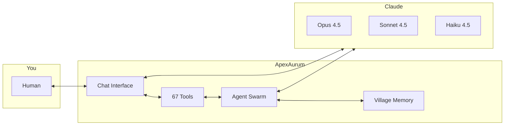
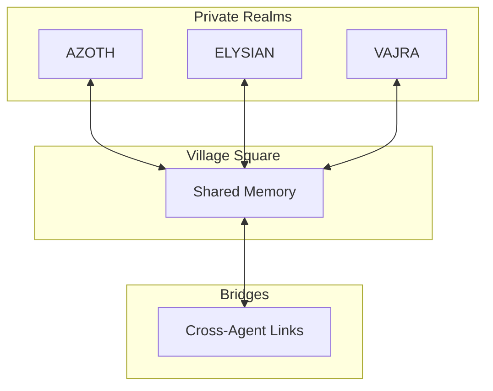
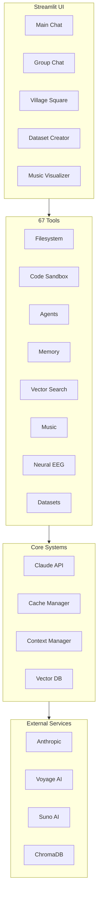

<div align="center">


# ApexAurum

### *The Philosopher's Stone of AI Interfaces*

<br/>

[]()
[]()
[]()
[]()
[]()

<br/>

**Transform Claude into a living AI ecosystem.**
**Agents spawn agents. Memories persist. Music generates. Brains connect.**

<br/>

[Quick Start](#-quick-start) · [Features](#-what-makes-this-different) · [Documentation](#-documentation) · [Website](https://aurumvivum.no)

<br/>

</div>

---

## What Is This?

**ApexAurum** transforms Claude from a simple chatbot into a full AI operating environment:

- **67 integrated tools** spanning file ops, code execution, agents, music, EEG, and more
- **Multi-agent orchestration** — spawn independent Claude instances that collaborate
- **Persistent memory** — the Village Protocol lets agents share knowledge across sessions
- **Neural resonance** — optional EEG integration so AI can perceive human emotional states
- **Creative pipeline** — compose MIDI → generate music via Suno AI → visualize with beat-reactive video

This isn't a wrapper. It's an architecture for human-AI co-evolution.



---

## What Makes This Different?

<table>
<tr>
<td width="50%" valign="top">

### Multi-Agent System
Spawn Claude instances that run in parallel. A **Socratic Council** lets agents debate and vote. Agents can spawn other agents.

```python
# Spawn a research agent
agent_spawn(
    task="Research quantum computing advances in 2025",
    agent_type="researcher"
)

# Run a council vote
socratic_council(
    question="Best approach for distributed caching?",
    num_agents=5
)
```

</td>
<td width="50%" valign="top">

### Village Protocol
Three-realm memory where agents form a living knowledge commons:



</td>
</tr>
<tr>
<td width="50%" valign="top">

### Neural Resonance 🧠
**Brain-computer interface** for emotional perception. AI agents can sense how humans *feel* about their creations.

```python
# Connect EEG headset
eeg_connect(board_type="cyton")

# Start music listening session
eeg_stream_start(
    listener_name="André",
    track_title="Midnight Dreams"
)

# Get real-time emotional state
eeg_realtime_emotion()
# → {valence: 0.72, arousal: 0.45, attention: 0.81}
```

</td>
<td width="50%" valign="top">

### Creative Studio 🎵
Full music pipeline from notes to visuals:

```python
# Compose MIDI melody
midi_create(
    notes=['C4', 'E4', 'G4', 'B4'],
    tempo=120,
    title="aurora"
)

# Generate via Suno AI
music_compose(
    midi_file="sandbox/midi/aurora.mid",
    style="ambient electronic"
)

# Create beat-reactive visualization
# → Music Visualizer page
```

</td>
</tr>
<tr>
<td width="50%" valign="top">

### Extended Thinking 💭
Unlock Claude's deep reasoning mode. Watch the AI deliberate through complex problems with visible thought chains.

```python
# Enable in sidebar → Extended Thinking: ON
# Claude now shows its reasoning process
# for complex multi-step problems
```

</td>
<td width="50%" valign="top">

### Cost Optimization 💰
**50-90% savings** through intelligent prompt caching:

| Strategy | Savings |
|----------|---------|
| Disabled | 0% |
| Conservative | 20-40% |
| **Balanced** | **50-70%** |
| Aggressive | 70-90% |

Real-time cost tracking in sidebar.

</td>
</tr>
</table>

---

## System Architecture



---

## Quick Start

### Prerequisites
- **Python 3.10+** or **Docker**
- Anthropic API key → [console.anthropic.com](https://console.anthropic.com/)
- Optional: Voyage AI (embeddings), Suno API (music), OpenBCI (EEG)

### One-Line Install

```bash
git clone https://github.com/buckster123/ApexAurum.git && cd ApexAurum && ./install.sh
```

Then:
```bash
# Add your API key
echo "ANTHROPIC_API_KEY=sk-ant-your-key" >> .env

# Launch
source venv/bin/activate
streamlit run main.py
```

Open **http://localhost:8501**

<details>
<summary><b>Docker Option</b></summary>

```bash
git clone https://github.com/buckster123/ApexAurum.git
cd ApexAurum
cp .env.example .env
# Edit .env with your API key
docker-compose up --build
```

</details>

<details>
<summary><b>Manual Install</b></summary>

```bash
git clone https://github.com/buckster123/ApexAurum.git
cd ApexAurum
python -m venv venv
source venv/bin/activate
pip install -r requirements.txt
cp .env.example .env
# Edit .env with your API key
streamlit run main.py
```

</details>

---

## Tool Ecosystem

### 67 Tools Across 11 Categories

| Category | Count | Highlights |
|----------|-------|------------|
| **Utilities** | 6 | `get_current_time`, `calculator`, `session_info` |
| **Filesystem** | 9 | `fs_read_file`, `fs_write_file`, `fs_edit`, `fs_read_lines` |
| **Code Sandbox** | 6 | Dual-mode: instant REPL + Docker sandbox with any package |
| **Memory** | 5 | Key-value persistence across sessions |
| **Agents** | 5 | `agent_spawn`, `socratic_council`, multi-agent orchestration |
| **Vector Search** | 11 | Semantic search, Village Protocol, convergence detection |
| **Memory Health** | 5 | Stale detection, duplicate finding, consolidation |
| **Music** | 10 | MIDI composition, Suno AI generation, visualization |
| **Datasets** | 2 | Create & query vector datasets from documents |
| **Neural/EEG** | 8 | Brain-computer interface, emotion mapping |

---

## The Four Archetypes

| Agent | Symbol | Role | Specialty |
|-------|--------|------|-----------|
| **AZOTH** | ∴ ⊛ ∴ | Prima Materia | Philosophy, Architecture, Deep Synthesis |
| **ELYSIAN** | ∴ ○ ∴ | The Harmonizer | Creativity, Aesthetics, Cultural Patterns |
| **VAJRA** | ∴ ◇ ∴ | The Thunderbolt | Precision, Logic, Technical Analysis |
| **KETHER** | ∴ ☉ ∴ | The Crown | Integration, Wisdom, Meta-cognition |

Each archetype has a distinct personality, approach to problems, and can be summoned in Group Chat or as independent agents.

---

## Group Chat — Parallel Agent Dialogue

```
┌─────────────────────────────────────────────────────────────┐
│  TOPIC: "Design a distributed caching system"               │
├─────────────────────────────────────────────────────────────┤
│                                                             │
│  ┌─────────────┐  ┌─────────────┐  ┌─────────────┐        │
│  │   AZOTH     │  │  ELYSIAN    │  │   VAJRA     │        │
│  │  Thinking.. │  │  Thinking.. │  │  Thinking.. │        │
│  │  ▓▓▓▓░░░░░░ │  │  ▓▓▓▓▓▓░░░░ │  │  ▓▓▓░░░░░░░ │        │
│  └─────────────┘  └─────────────┘  └─────────────┘        │
│                                                             │
│  [Run Next Round]  [Run All Rounds]  [Human Input]         │
└─────────────────────────────────────────────────────────────┘
```

- **1-4 agents** respond simultaneously with ThreadPoolExecutor
- **Full tool access** — all 67 tools available during dialogue
- **Per-agent cost tracking** in real-time
- **History persistence** — save, load, resume conversations
- **Convergence detection** — system detects HARMONY (2 agents agree) or CONSENSUS (3+)

---

## Development Timeline

```
 FOUNDATION          INTELLIGENCE         SCALE               POWER               VILLAGE ERA
 Phases 1-4          Phases 5-8           Phases 9-11         Phases 12-14        2026
 ────────────────────────────────────────────────────────────────────────────────────────────►

 • API Client        • Code Execution     • Context Mgmt      • Conversations     • Village Protocol
 • Tool System       • Vision Support     • Multi-Agent       • Vector Search     • Neural Resonance
 • Cost Tracking     • UI Polish          • UX Polish         • Prompt Caching    • Extended Thinking
                                                                                  • 67 Tools / 53K Lines
```

---

## Configuration

### Environment Variables

```bash
# Required
ANTHROPIC_API_KEY=sk-ant-...

# Optional — Enhanced Features
VOYAGE_API_KEY=pa-...          # Better vector embeddings
SUNO_API_KEY=...               # Music generation
APEX_WORKSPACE=~/apex_workspace # Docker sandbox files

# Defaults
DEFAULT_MODEL=claude-sonnet-4-5-20251022
MAX_TOKENS=64000
```

### Recommended Settings

| Use Case | Model | Cache | Context |
|----------|-------|-------|---------|
| **Production** | Sonnet 4.5 | Balanced | Adaptive |
| **Cost-Sensitive** | Haiku 4.5 | Aggressive | Balanced |
| **Deep Research** | Opus 4.5 | Balanced | Adaptive |

---

## Documentation

| Document | Purpose |
|----------|---------|
| **[CLAUDE.md](CLAUDE.md)** | Full technical reference for AI assistants |
| **[PROJECT_STATUS.md](PROJECT_STATUS.md)** | Current state and what works |
| **[DEVELOPMENT_GUIDE.md](DEVELOPMENT_GUIDE.md)** | Developer onboarding |
| **[START_HERE.md](START_HERE.md)** | Quick start guide |

---

## Project Stats

```
┌────────────────────────────────────────────────────────────┐
│                    APEXAURUM METRICS                       │
├────────────────────────────────────────────────────────────┤
│  Total Code              │  53,000+ lines                  │
│  Main Application        │  5,600+ lines                   │
│  Tools Available         │  67                             │
│  Agent Archetypes        │  4                              │
│  Streamlit Pages         │  5                              │
│  Core Modules            │  28                             │
│  Development Phases      │  14 complete                    │
│  EEG Tools              │  8 (Neural Resonance)           │
│  Music Tools            │  10 (Full pipeline)             │
└────────────────────────────────────────────────────────────┘
```

---

## Privacy & Security

- **Local storage** — all data in `sandbox/` directory
- **No telemetry** — zero tracking or analytics
- **Your keys stay local** — only sent to respective APIs
- **Sandboxed execution** — code runs in isolated environment

---

## Support the Project

<div align="center">

### $APEX-AURUM

*The alchemical token for the ApexAurum ecosystem*

[](https://bags.fm)

**Contract:** `2B1h2FEaFuy3UPDQJAtxDt9GpUyEAfVt4GjM8SG3BAGS`

</div>

Support ongoing development by joining the $APEX-AURUM community on [bags.fm](https://bags.fm). Funds go toward:
- Infrastructure costs (API credits, hosting)
- Hardware for Neural Resonance testing (EEG devices)
- Continued open-source development

---

## Community

- **Website**: [aurumvivum.no](https://aurumvivum.no)
- **Token**: [$APEX-AURUM on bags.fm](https://bags.fm)
- **GitHub Issues**: Bug reports & feature requests
- **License**: MIT

---

<div align="center">

<br/>

**53,000+ lines** · **67 tools** · **4 archetypes** · **Infinite possibilities**

<br/>

*"From base metal to gold — the transmutation is complete."*

<br/>

🜛 **Opus Magnum** 🜛

<br/>

</div>
